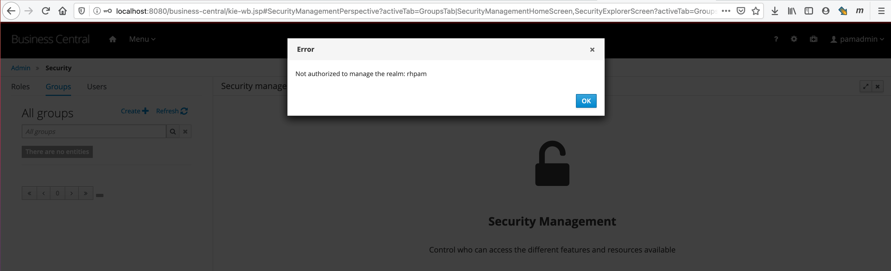

# RHPAM 7.x -> SSO 7.x -> LDAP -> Roles

El objetivo de este documento es decribir los pasos basicos para montar:

- Servidor LDAP / AD: Con 1 usuario administrador rol 'admin' con acceso total al 'business-central' y 2 usuarios con rol 'user' asociados al grupo 'grupo1'
- Servidor SSO integrado con con LDAP, configurado para asociar los grupos del LDAP a roles del SSO.
- RHPAM (BC y KieServer) integrado con el SSO para seguridad.

La inteción es demostrar como crear un proceso desde cero a travez del business-central, configurar actores y grupos, desplegar el proceso en el KieServer e interactuar con la API para transiciónar las tareas. A su vez demostrar, la correcta configuración de la integración con el SSO / LDAP y los usuarios.

Seguidamente se va explicar los pasos necesarios para:

- Instalar y configurar servidor [LDAP](#ldap)
- Instalar y configurar [RHSSO](#rhsso-7x)
- Instalar y configurar [RHPAM](#rhpam-7x)
- Probar todo con un proceso de [prueba](#test).

---

## Demo


## LDAP

### Servidor

Descargamos ApacheDS

https://directory.apache.org/apacheds/downloads.html

Descomprimimos y ejecutamos

```sh
./bin/apacheds.sh start
```

### Cliente

Descargamos Apache Directory Studio

https://directory.apache.org/studio/

#### Configuración

Una vez abierto el cliente, creamos una nueva conexion "New Connection..." e ingresamos los siguientes datos:

Network Parameter:

- Connection name: rhpam
- Hostname: localhost
- Port: 10389

Authentication:

- Bind DN or user: uid=admin,ou=system
- Bind Password: secret

Ingresamos con el cliente al servidor ldap, y creamos:

- Usuarios
  - pamAdmin: 'uid=pamAdmin,ou=User,ou=bpm,ou=system'
  - user1: 'uid=user1,ou=User,ou=bpm,ou=system'
  - user2: 'uid=user2,ou=User,ou=bpm,ou=system'

- Grupos
  - admin: 'cn=admin,ou=Group,ou=bpm,ou=system'
  - grupo1: 'cn=grupo1,ou=Group,ou=bpm,ou=system'
  - user: 'cn=user,ou=Group,ou=bpm,ou=system'

Deberia quedar de la siguiente manera:


(Adjunto archivo ldap.ldif con toda la organización)

### Consultas con 'ldapserch':

Obtiene todos (sin filtro) los DN de un basedn y sus hijos:

```sh
ldapsearch -z 0 -H ldap://localhost:10389 -D "uid=admin,ou=system" -w 'secret' -b "ou=User,ou=bpm,ou=system" "(objectclass=*)" | grep -e "dn: "
```

Obtiene todos los DN del 1er nivel de un basedn:
```sh
ldapsearch -z 0 -H ldap://localhost:10389 -D "uid=admin,ou=system" -w 'secret' -b "ou=system" -s one | grep -e "dn: "
```

## RHSSO 7.x

Descargamos 'rh-sso-7x.zip' y ejecutamos:

```sh
./standalone.sh -Djboss.socket.binding.port-offset=100
```

### Configuración

Accedemos 'http://localhost:8180/auth', en este primer acceso nos va a solicitar usuario y clave para el administrador. Ingresamos user: admin, password: redhat01.

Una vez dentro de la consola, creamos el realm "rhpam". Seguidamente creamos los siguientes clientes:

- kie: Client Protocol: openid-connect / Access Type: confidential

- kie-execution-server: Client Protocol: openid-connect / Access Type: confidential

Seguidamente configuremos la integración con AD (ApacheDS) agregando en 'User Federation' un provider del tipo LDAP, configurar como se muestra en la imagen:


Oprimimos en 'Save' y seguidamente en 'Synchronize all users'

Verifiquemos que los usuarios se hayan importando correctamente, para esto vamos 'Users' en el menu de la izquierda. Seguidamente oprimir el boton 'View all users', si todo sale bien deberiamos ver los 3 usuarios existentens en el ldap como se ven en la siguiente imagen:


Ahora nos queda agregar un mapper para asociar los grupos de ldap a roles en el sso, para esto vamos al Tab 'Mappers' y creamos uno del tipo 'role-ldap-mapper' como se muestra en la imagen:


Oprimimos en 'Save' y seguidamente en 'Sync LDAP Roles to Keycloak'

Seguidamente modificamos el mapper
 
 - 'username' modificando el atributo 'LDAP Attribute' con 'uid'
 - 'last name' modificando el atributo 'LDAP Attribute' con 'sn'

#### Configuracion Alternativa
Tambien es posible mappear grupos de ldap a roles en el SSO (en forma manual), para esto en vez de crear un role-ldap-mapper debemos crear un 'group-ldap-mapper' como se ve en la imagen:


Seguidamente crear los roles en SSO:


Y asociar el grupo importado anteriormente al rol de PAM que requiera:


## RHPAM 7.x

### Descargamos 

- JBOSS EAP 7.x (jboss-eap-7.x.zip)
- Business Central (rhpam-7.x-business-central-eap7-deployable.zip)
- KieServer (rhdm-7.x-kie-server-ee8.zip)
- Adaptador de RHSSO 7.x para EAP 7.x (rh-sso-7.x.GA-eap7-adapter.zip)

### Instalación

1. Descromprimimos el jboss-eap
1. Descromprimimos / reemplazamos el contenidos del directorio del 'business-central' dentro del 'jboss-eap'
1. Descromprimimos / reemplazamos el contenidos del directorio del 'kie-server' dentro del 'jboss-eap/standalone/deployments'
1. Descromprimimos / reemplazamos el contenidos del directorio del 'rhsso-adapter' dentro del 'jboss-eap'

### Configuración 

Reemplazamos el archivo 'jboss-eap/standalone/configuration/standalone-full.xml' por el existente en este repositorio (standalone-full.xml.sso). 

Modificar el secret para el cliente kie y kie-execution-server del SSO. Para esto buscar el tag '\<credential name="secret"\>' y modificar el que corresponda.


#### Configuración Alternativa

Tambien es posible integrar contra el ldap directamente registrando un nuevo 'security-domain' (para esto reemplazar con el archivo standalone-full.xml.ldap)

Es posible tambien cargar los usuarios y roles desde el EAP para esto ejecutar:
```sh
./add-user.sh -a -u 'admin' -p 'redhat01' -g 'admin'
./add-user.sh -a -u 'analyst' -p 'redhat01' -g 'analyst'
./add-user.sh -a -u 'developer' -p 'redhat01' -g 'developer'
./add-user.sh -a -u 'manager' -p 'redhat01' -g 'manager'
./add-user.sh -a -u 'process-admin' -p 'redhat01' -g 'process-admin'
./add-user.sh -a -u 'user' -p 'redhat01' -g 'user'
./add-user.sh -a -u 'rest-all' -p 'redhat01' -g 'rest-all'
./add-user.sh -a -u 'kie-server' -p 'redhat01' -g 'kie-server'

./add-user.sh -a -u 'user1' -p 'redhat01' -g 'user,grupo1'
./add-user.sh -a -u 'user2' -p 'redhat01' -g 'user,grupo1'
./add-user.sh -a -u 'user3' -p 'redhat01' -g 'user,grupo1,grupo2,grupo3'
```
(Si se usa esta opcion, omitir las configuracion para sso o ldap. Usar la configuracion por default)

Resumen de los roles disponibles
```
admin         # Si BC / No KIE   -> Todo
analyst       # Si BC / No KIE   -> Solo falta Deploy
developer     # Si BC / No KIE   -> Desing (todo), Deploy (Solo Servers) -> Manage (Falta Task y Excecution Errors) -> Track (todo)
manager       # Si BC / No KIE   -> Sin config -> Track (Sin Task Inbox)
process-admin # Si BC / No KIE   -> Sin config -> Manage (Sin Jobs) -> Track (todo)
user          # Si BC / Si KIE   -> Sin config -> Manage (Proccess definitions, Process Instances) -> Track (Task Inbox, Process Report, Task Report)
rest-all      # No BC / No KIE   -> 
kie-server    # No BC / Si KIE   -> 
```

Iniciemos el jboss-eap de la siguiente manera:
```sh
bin/standalone.sh -c standalone-full.xml
```

Se creo un appender para la seguridad y de esa forma auditar los roles de los usuarios de la siguiente forma:
```sh
tail -f audit.log | grep -e "Authenticated as"
```

Ingresemos a 'http://localhost:8180/business-central' con el usuario 'pamadmin'. Si los usuarios en ldap estan bien cargados y la integracion entre ldap -> rhsso -> rhpam es correcta, vamos a lograr entrar a la pantalla principal del bc.


### Caso de prueba

Ahora estamos listos para empezar a diseñar nuestro primer proceso, para esto ingresamos en 'HOME_BC -> Design -> Projects', seguidamente:

Agregamos un nuevo Space de nombre 'MySpace'

Agregemos un nuevo proyecto de nombre 'test' dentro del space creado anteriormente

Agregamos un nuevo 'asset' del tipo 'Business Process' de nombre 'process' (dejar el package que esta seleccionado por default)

Agregemos 3 tareas del tipo 'HumanTask'

En la primera tarea 'Task1' agregar como actor a 'user1'


En la segunda tarea 'Task2' agregar como actor a 'user2'


En la tercera tarea 'Task3' agregar como grupo a 'grupo1'


Se adjunta la definicion del proceso 'process.bpmn' para ser importado como se muestra en la imagen:


Deshabilitemos 'Development Mode' en la seccion 'settings' y oprimir en 'save'


Desplegamos el proceso en el kie-server, para esto oprimimos sobre el boton 'deploy'


Validemos que el despliegue en el kie sea exitoso, para esto vamos a la seccion 'HOME_BC -> Deploy -> Servers' y verifiquemos que la version 'v1.0.0' del proceso 'test_1.0.0' este desplegada (tilde verde)


## TEST

Lo que se intenta probar es, crear una instancia del proceso de 'test', consultar las tareas del usuario 'user1', iniciar y finalizar la tarea 'Task1'. De esta manera sera asignada al siguente usuario 'user2', de la misma manera, iniciar y terminar la tarea 'Task2'. Para finalizar, la proxima Tarea 'Task3' no esta asignada a ninguno de los usuarios, sino que al grupo. Para esto primero verifiquemos cuales son las posibles tareas del usuario/grupo. La tomamos, la inicamos y la terminamos. Para hacer todo esto, es necesario contar con estos curl para interactuar con el kie:

Primero definamos estas variables de ambiente:

```sh
export pam_user=user1
export pam_basic=user1:redhat01
export pam_kiecontainerId=test_1.0.0
export pam_processId=test.process
export pam_taskId=1
```

Para verificar la configuracion ejecute:
```sh
env | grep pam
```
Verifiquemos si el kiecontainer este desplegado:
```sh
curl -X GET "http://localhost:8080/kie-server/services/rest/server/containers" -H  "accept: application/json" -u ${pam_basic} | jq
```
Creamos una instancia de proceso
```sh
curl -X POST "http://localhost:8080/kie-server/services/rest/server/containers/${pam_kiecontainerId}/processes/${pam_processId}/instances" -H  "accept: application/json" -H  "content-type: application/json" -d "{    \"var1\": 6}" -u ${pam_basic}
```
Verifiquemos las instancias del proceso creadas
```sh
curl -X GET "http://localhost:8080/kie-server/services/rest/server/containers/${pam_kiecontainerId}/processes/instances?page=0&pageSize=10&sortOrder=true" -H  "accept: application/json" -u ${pam_basic} | jq
```
---

Verificaar las tareas del usuario
```sh
curl -X GET "http://localhost:8080/kie-server/services/rest/server/queries/tasks/instances/owners?status=Reserved&user=${pam_user}&page=0&pageSize=10&sortOrder=true" -H  "accept: application/json" -u ${pam_basic} | jq
```
Verificar las tareas que el usuario puede tomar (en el caso que la tarea este en un grupo)
```sh
curl -X GET "http://localhost:8080/kie-server/services/rest/server/queries/tasks/instances/pot-owners?status=Ready&user=${pam_user}&page=0&pageSize=10&sortOrder=true" -H  "accept: application/json" -u ${pam_basic} | jq
```
---

Toma la tarea pero no la inicia
```sh
curl -X PUT "http://localhost:8080/kie-server/services/rest/server/containers/${pam_kiecontainerId}/tasks/${pam_taskId}/states/claimed" -H  "accept: application/json" -u ${pam_basic}
```
Inicia una tarea tomada
```sh
curl -X PUT "http://localhost:8080/kie-server/services/rest/server/containers/${pam_kiecontainerId}/tasks/${pam_taskId}/states/started" -H  "accept: application/json" -u ${pam_basic}
```
Verifica el estado de una tarea
```sh
curl -X GET "http://localhost:8080/kie-server/services/rest/server/queries/tasks/instances/${pam_taskId}?withSLA=false" -H  "accept: application/json" -u ${pam_basic} | jq
```
Terminar tarea
```sh
curl -X PUT "http://localhost:8080/kie-server/services/rest/server/containers/${pam_kiecontainerId}/tasks/${pam_taskId}/states/completed" -H  "accept: application/json" -H  "content-type: application/json" -d "{    \"var1\": 4}" -u ${pam_basic}
```
Consultar la imagen del proceso
```sh
curl -X GET "http://localhost:8080/kie-server/services/rest/server/containers/${pam_kiecontainerId}/images/processes/instances/${pam_taskId}" -u ${pam_basic}
```

## Errores conocidos

Si al acceder a la pantalla de seguridad (HOME_BC > Settings > Security) nos encontramos con que no puede obtener los grupos o usuarios:




Lo que esta sucediendo es que el usuario actual no tiene los roles de "realm-management" necesarios, para resolverlo hay que acceder a la consola del RHSSO, seleccionar el usuario que se le quiere otorgar los permisos (para este ejemplo "pamAdmin") y ortorgarle "view-*" como se muestra en la imagen


Si todo resuelta bien, podremos visualizar los grupos y usuario desde la seccion de seguridad de BC


